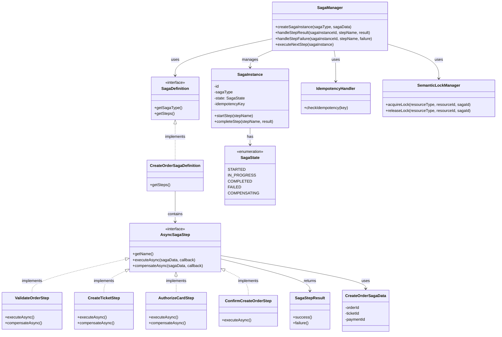
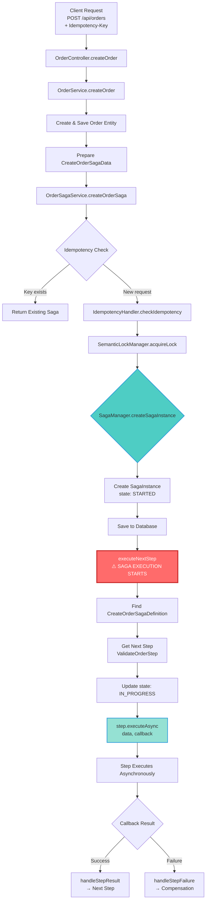
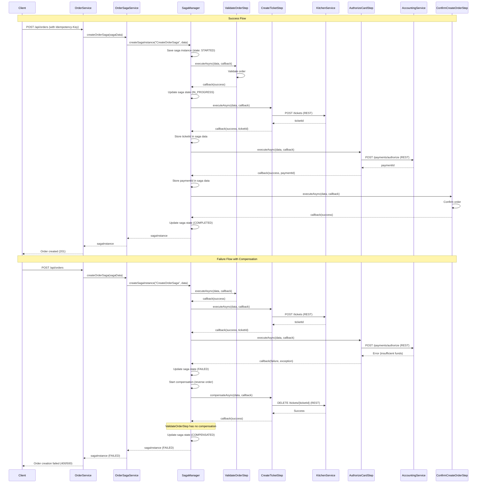
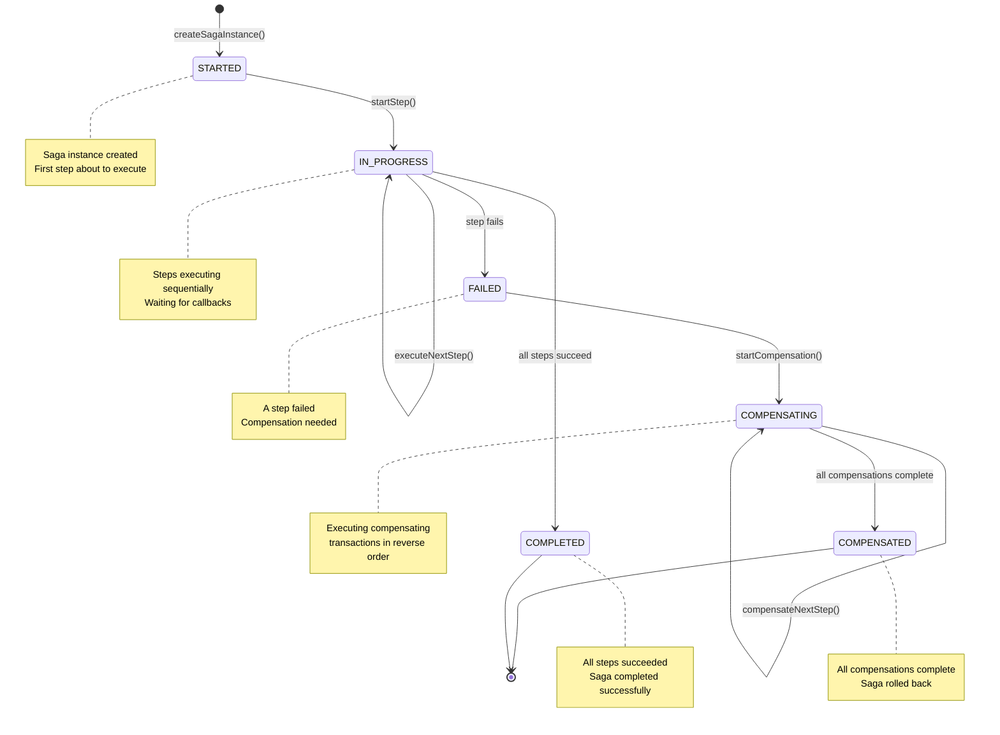

# FTGO Microservices Application

A complete Food to Go (FTGO) microservices application built with Spring Boot 3.3.x, implementing modern microservices patterns and best practices.

## Architecture Overview

This application demonstrates a complete microservices architecture with the following services:

- **Customer Service** - Customer registration and payment method management
- **Restaurant Service** - Restaurant and menu management
- **Order Service** - Order creation and management with Saga pattern
- **Kitchen Service** - Kitchen ticket management
- **Delivery Service** - Courier and delivery tracking
- **Accounting Service** - Billing and payment processing
- **API Gateway** - Single entry point for all client requests

## Technology Stack

- **Java**: 17
- **Spring Boot**: 3.3.4
- **Spring Cloud**: 2023.0.3
- **Database**: PostgreSQL (database per service pattern)
- **Message Broker**: Apache Kafka
- **Service Discovery**: Consul
- **API Gateway**: Spring Cloud Gateway
- **Build Tool**: Maven
- **Containerization**: Docker & Docker Compose
- **Observability**: Spring Cloud Sleuth, Micrometer, Prometheus, Zipkin

## Key Patterns Implemented

1. **Saga Pattern (Orchestration-based)** - Distributed transaction management using centralized orchestration
2. **Compensating Transactions** - Rollback mechanism for failed sagas
3. **Idempotency** - Handling duplicate requests gracefully
4. **Semantic Locking** - Handling lack of isolation in distributed transactions
5. **CQRS** - Command Query Responsibility Segregation where appropriate
6. **Event Sourcing** - Domain events stored and published via Kafka
7. **API Composition** - API Gateway aggregates requests from multiple services
8. **Service Discovery** - Consul for service registration and discovery
9. **Circuit Breaker** - Resilience4j for fault tolerance
10. **Database per Service** - Each service has its own PostgreSQL database

## Prerequisites

- Java 17 or higher
- Maven 3.8+
- Docker and Docker Compose
- At least 8GB RAM available for Docker containers

## Quick Start

### 1. Start Infrastructure Services

Start all infrastructure services (PostgreSQL, Kafka, Zookeeper, Consul, Zipkin) using Docker Compose:

```bash
docker-compose up -d
```

This will start:
- PostgreSQL (single instance hosting all service databases)
- Kafka and Zookeeper
- Consul (service discovery)
- Zipkin (distributed tracing)
- Redis (for distributed locking)

### 2. Build the Project

Build all modules:

```bash
mvn clean install
```

### 3. Start Microservices

Start each service in separate terminals or use your IDE:

```bash
# Terminal 1 - Customer Service
cd ftgo-customer-service
mvn spring-boot:run

# Terminal 2 - Restaurant Service
cd ftgo-restaurant-service
mvn spring-boot:run

# Terminal 3 - Order Service
cd ftgo-order-service
mvn spring-boot:run

# Terminal 4 - Kitchen Service
cd ftgo-kitchen-service
mvn spring-boot:run

# Terminal 5 - Delivery Service
cd ftgo-delivery-service
mvn spring-boot:run

# Terminal 6 - Accounting Service
cd ftgo-accounting-service
mvn spring-boot:run

# Terminal 7 - API Gateway
cd ftgo-api-gateway
mvn spring-boot:run
```

### 4. Verify Services

- **API Gateway**: http://localhost:8080
- **Customer Service**: http://localhost:8081
- **Restaurant Service**: http://localhost:8082
- **Order Service**: http://localhost:8083
- **Kitchen Service**: http://localhost:8084
- **Delivery Service**: http://localhost:8085
- **Accounting Service**: http://localhost:8086
- **Consul UI**: http://localhost:8500
- **Zipkin**: http://localhost:9411

## API Documentation

Each service exposes Swagger/OpenAPI documentation:

- API Gateway: http://localhost:8080/swagger-ui.html
- Customer Service: http://localhost:8081/swagger-ui.html
- Restaurant Service: http://localhost:8082/swagger-ui.html
- Order Service: http://localhost:8083/swagger-ui.html
- Kitchen Service: http://localhost:8084/swagger-ui.html
- Delivery Service: http://localhost:8085/swagger-ui.html
- Accounting Service: http://localhost:8086/swagger-ui.html

## Example Workflow

### 1. Register a Customer

```bash
curl -X POST http://localhost:8080/api/customers \
  -H "Content-Type: application/json" \
  -d '{
    "name": "John Doe",
    "email": "john.doe@example.com",
    "address": {
      "street1": "123 Main St",
      "city": "San Francisco",
      "state": "CA",
      "zip": "94102"
    }
  }'
```

### 2. Create a Restaurant

```bash
curl -X POST http://localhost:8080/api/restaurants \
  -H "Content-Type: application/json" \
  -d '{
    "name": "Pizza Palace",
    "address": "456 Market St, San Francisco, CA 94102"
  }'
```

### 3. Add Menu Items

```bash
curl -X PUT http://localhost:8080/api/restaurants/{restaurantId}/menu \
  -H "Content-Type: application/json" \
  -d '{
    "menuItems": [
      {
        "name": "Margherita Pizza",
        "price": "15.99",
        "currency": "USD"
      },
      {
        "name": "Pepperoni Pizza",
        "price": "17.99",
        "currency": "USD"
      }
    ]
  }'
```

### 4. Create an Order (with Saga Orchestration)

```bash
curl -X POST http://localhost:8080/api/orders \
  -H "Content-Type: application/json" \
  -H "Idempotency-Key: unique-key-123" \
  -d '{
    "customerId": "{customerId}",
    "restaurantId": "{restaurantId}",
    "lineItems": [
      {
        "menuItemId": "{menuItemId}",
        "name": "Margherita Pizza",
        "quantity": 2,
        "price": "15.99",
        "currency": "USD"
      }
    ],
    "deliveryAddress": "123 Main St, San Francisco, CA 94102",
    "deliveryTime": "2024-12-20T18:00:00Z"
  }'
```

**Note**: The `Idempotency-Key` header is optional but recommended to prevent duplicate order creation. The order creation triggers a Create Order Saga that orchestrates validation, ticket creation, and payment authorization.

### 5. Process the Order Flow (Orchestration-Based Saga)

The order creation process is orchestrated by the SagaManager:

1. **Order Created**: Order service creates order and initiates Create Order Saga
2. **Saga Orchestration**: SagaManager coordinates the following steps:
   - **ValidateOrderStep**: Validates and approves the order
   - **CreateTicketStep**: Orchestrator commands Kitchen Service to create ticket
   - **AuthorizeCardStep**: Orchestrator commands Accounting Service to authorize payment
   - **ConfirmCreateOrderStep**: Confirms order creation
3. **Compensation**: If any step fails, compensating transactions execute in reverse order
4. **Event Publishing**: Events are published for other services (delivery, etc.)

## Project Structure

```
ftgo-microservices/
├── ftgo-common/              # Shared utilities and event definitions
├── ftgo-api-gateway/         # API Gateway service
├── ftgo-customer-service/    # Customer management
├── ftgo-restaurant-service/  # Restaurant and menu management
├── ftgo-order-service/       # Order management
├── ftgo-kitchen-service/     # Kitchen ticket management
├── ftgo-delivery-service/    # Delivery and courier management
├── ftgo-accounting-service/  # Billing and payment processing
├── docker-compose.yml        # Infrastructure services
└── README.md                 # This file
```

## Service Ports

| Service | Port |
|---------|------|
| API Gateway | 8080 |
| Customer Service | 8081 |
| Restaurant Service | 8082 |
| Order Service | 8083 |
| Kitchen Service | 8084 |
| Delivery Service | 8085 |
| Accounting Service | 8086 |

## Database Configuration

All services use a single PostgreSQL instance on port **5432**, with separate databases for each service:

| Service | Database Name |
|---------|---------------|
| Customer Service | ftgo_customer |
| Restaurant Service | ftgo_restaurant |
| Order Service | ftgo_order |
| Kitchen Service | ftgo_kitchen |
| Delivery Service | ftgo_delivery |
| Accounting Service | ftgo_accounting |

**PostgreSQL Connection**: `localhost:5432`
**Username**: `ftgo`
**Password**: `ftgo123`

## Saga Pattern Implementation

This application implements the **Orchestration-Based Saga Pattern** for managing distributed transactions across microservices.

### Saga Orchestration Architecture

The Create Order Saga is orchestrated by the `SagaManager` which coordinates all steps:

```
SagaManager (Orchestrator)
    ↓ (REST Command)
ValidateOrderStep → Order Service (validates order)
    ↓ (Callback: Success)
    ↓ (REST Command)
CreateTicketStep → Kitchen Service (creates ticket)
    ↓ (Callback: Success)
    ↓ (REST Command)
AuthorizeCardStep → Accounting Service (authorizes payment)
    ↓ (Callback: Success)
    ↓
ConfirmCreateOrderStep → Order Service (confirms order)
    ↓ (Callback: Success)
Saga Completed
```

### Saga Components

**Location**: `ftgo-order-service/src/main/java/com/ftgo/orderservice/saga/`

- **SagaManager**: Central orchestrator that manages saga execution
- **SagaDefinition**: Interface for defining saga steps
- **CreateOrderSagaDefinition**: Implementation of the Create Order Saga
- **AsyncSagaStep**: Interface for async saga steps with callbacks

### Saga Class Diagram



### Create Order Saga Steps

1. **ValidateOrderStep**: Validates the order
   - Compensation: Rejects the order

2. **CreateTicketStep**: Creates a kitchen ticket via REST command
   - Compensation: Cancels the ticket

3. **AuthorizeCardStep**: Authorizes customer's credit card via REST command
   - Compensation: Releases the authorization

4. **ConfirmCreateOrderStep**: Confirms order creation (final step)
   - No compensation needed

### Key Features

- **Orchestration-Based**: Central coordinator (SagaManager) manages saga flow
- **Compensating Transactions**: Each step has a compensating action executed in reverse order on failure
- **Idempotent Operations**: Duplicate requests are handled gracefully using idempotency keys
- **Semantic Locking**: Prevents concurrent modifications during saga execution
- **Saga State Management**: Persistent saga state tracking in database
- **Timeout Handling**: Automatic timeout detection (30 min saga, 5 min step) and compensation

### Usage Example

```java
// Create order through saga
CreateOrderSagaData sagaData = new CreateOrderSagaData();
sagaData.setOrderId(orderId);
sagaData.setCustomerId(customerId);
sagaData.setRestaurantId(restaurantId);
sagaData.setIdempotencyKey(idempotencyKey);

SagaInstance sagaInstance = orderSagaService.createOrderSaga(sagaData);
```

### Saga Database Schema

```sql
-- Saga instances table
CREATE TABLE saga_instances (
    id VARCHAR(255) PRIMARY KEY,
    saga_type VARCHAR(100) NOT NULL,
    state VARCHAR(50) NOT NULL,
    saga_data TEXT,
    idempotency_key VARCHAR(255),
    created_at TIMESTAMP NOT NULL,
    completed_at TIMESTAMP,
    failure_reason VARCHAR(500)
);

-- Saga step executions table
CREATE TABLE saga_step_executions (
    id VARCHAR(255) PRIMARY KEY,
    saga_instance_id VARCHAR(255) NOT NULL,
    step_name VARCHAR(100) NOT NULL,
    state VARCHAR(50) NOT NULL,
    result TEXT,
    started_at TIMESTAMP NOT NULL,
    completed_at TIMESTAMP,
    failure_reason VARCHAR(500),
    FOREIGN KEY (saga_instance_id) REFERENCES saga_instances(id)
);
```

### Saga Flow

1. **Saga Creation**: Order service creates a saga instance via `OrderSagaService`
2. **Step Execution**: SagaManager executes steps sequentially via REST commands
3. **Callback Handling**: Steps report results back to orchestrator via callbacks
4. **Step Result Processing**: SagaManager processes step results and executes next step
5. **Compensation**: If any step fails, compensating transactions are executed in reverse order

### Complete Trigger Flow Diagram

The following diagram shows how the saga is triggered from the initial HTTP request through to the first step execution:



**Key Trigger Points:**

1. **HTTP Request**: Client sends `POST /api/orders` with optional `Idempotency-Key` header
2. **Order Creation**: `OrderService` creates the order entity and prepares saga data
3. **Saga Service**: `OrderSagaService` handles idempotency and locking
4. **Saga Manager**: `SagaManager.createSagaInstance()` creates the saga instance
5. **Immediate Execution**: `executeNextStep()` is called immediately after creation (synchronous trigger)
6. **Async Steps**: Steps execute asynchronously and report back via callbacks

**Important Notes:**

- The saga execution starts **synchronously** during order creation, not via events
- `executeNextStep()` is called immediately after `createSagaInstance()` saves the saga
- Step execution is **asynchronous** with callbacks to continue the flow
- Idempotency prevents duplicate saga creation for the same request
- Semantic locks prevent concurrent modifications during saga execution

### Saga Flow Diagram

The following sequence diagram illustrates the complete flow of the Create Order Saga, including success and failure scenarios:



### Saga State Transitions

The following state diagram shows how a saga instance transitions through different states:



### Benefits

1. **Data Consistency**: Ensures eventual consistency across services
2. **Fault Tolerance**: Handles failures gracefully with compensation
3. **Centralized Control**: All saga logic in one place for easier debugging
4. **Scalability**: No distributed locks, better performance
5. **Maintainability**: Clear saga flow and state management
6. **Reliability**: Idempotency and timeout handling prevent data corruption

## Event Flow

The application uses both orchestration (for sagas) and event-driven communication (for notifications):

**Orchestration (Saga Coordination)**:
- SagaManager commands services via REST API
- Services respond with callbacks to orchestrator

**Event-Driven (Notifications)**:
1. **OrderCreated** → Published by Order Service
2. **OrderApproved** → Published by Order Service (after saga validation)
3. **TicketCreated** → Published by Kitchen Service
4. **TicketReady** → Published by Kitchen Service → Consumed by Delivery Service
5. **DeliveryCreated** → Published by Delivery Service
6. **DeliveryDelivered** → Published by Delivery Service → Consumed by Accounting Service

## Observability

### Health Checks

All services expose health endpoints:

```bash
curl http://localhost:8080/actuator/health
```

### Metrics

Prometheus metrics are available at:

```bash
curl http://localhost:8080/actuator/prometheus
```

### Distributed Tracing

Zipkin is available at http://localhost:9411 for distributed tracing across services.

## Testing

Run tests for all services:

```bash
mvn test
```

## Development Guidelines

1. **Code Quality**: Follow SOLID principles and clean architecture
2. **Error Handling**: Use custom exceptions and proper error responses
3. **Logging**: Structured logging with appropriate log levels
4. **Documentation**: API documentation with OpenAPI/Swagger
5. **Versioning**: Semantic versioning for releases

## Troubleshooting

### Services not starting

1. Check if all infrastructure services are running: `docker-compose ps`
2. Verify database connections in service logs
3. Check Consul for service registration: http://localhost:8500

### Kafka connection issues

1. Ensure Zookeeper is running: `docker ps | grep zookeeper`
2. Check Kafka logs: `docker logs ftgo-kafka`
3. Verify Kafka is accessible: `docker exec -it ftgo-kafka kafka-broker-api-versions --bootstrap-server localhost:9092`

### Database migration issues

1. Check Flyway migration logs in service startup
2. Verify database credentials in `application.yml`
3. Ensure databases are created and accessible

## Future Enhancements

### Saga Enhancements
- [ ] Add saga visualization and monitoring dashboard
- [x] Implement saga step retry with exponential backoff
- [ ] Add saga performance metrics
- [ ] Implement saga step parallel execution where possible
- [ ] Add saga testing framework

### General Enhancements
- [ ] Add authentication and authorization (JWT/OAuth2)
- [ ] Implement comprehensive integration tests
- [ ] Add contract testing with Spring Cloud Contract
- [ ] Implement caching with Redis
- [ ] Add rate limiting to API Gateway
- [ ] Implement API versioning strategy
- [ ] Add comprehensive monitoring dashboards
- [ ] Implement event sourcing with dedicated event store

## License

This project is for educational purposes, demonstrating microservices patterns.

## References

- Spring Boot Documentation: https://spring.io/projects/spring-boot
- Spring Cloud Documentation: https://spring.io/projects/spring-cloud
- Apache Kafka Documentation: https://kafka.apache.org/documentation/
- PostgreSQL Documentation: https://www.postgresql.org/docs/

