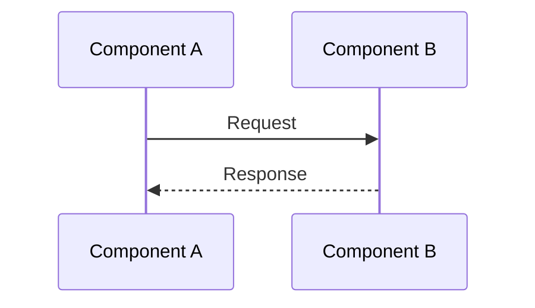
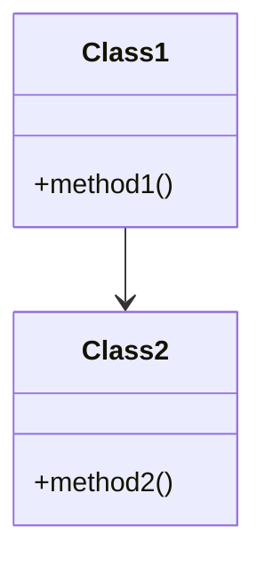

# Design Document: {Feature Name}

## Overview

High-level description of the design approach.

## Design Goals

- Goal 1
- Goal 2
- Goal 3

## Architecture

### System Design

Description of the overall system design.

### Component Design

#### Component 1

- **Purpose**: Description
- **Responsibilities**: List of responsibilities
- **Interfaces**: Interface descriptions
- **Dependencies**: Dependencies

#### Component 2

- **Purpose**: Description
- **Responsibilities**: List of responsibilities
- **Interfaces**: Interface descriptions
- **Dependencies**: Dependencies

## Design Patterns

### Pattern 1

- **Pattern**: Pattern name
- **Rationale**: Why this pattern was chosen
- **Implementation**: How it's implemented

## Data Model

### Entity 1

```java
@Entity
public class Entity1 {
    // Fields and methods
}
```

### Relationships

- Entity1 → Entity2: Relationship type

## API Design

### Endpoint 1

- **Method**: GET/POST/PUT/DELETE
- **Path**: `/api/path`
- **Request**: Request body/parameters
- **Response**: Response body
- **Status Codes**: 200, 400, 404, 500

## Event Design

### Event 1

- **Type**: Event type
- **Publisher**: Service name
- **Consumers**: Service names
- **Payload**: Event structure

## Database Schema

### Table 1

```sql
CREATE TABLE table1 (
    id VARCHAR(255) PRIMARY KEY,
    -- columns
);
```

## Sequence Diagrams



## Class Diagrams



## Error Handling

### Error Types

- Error 1: Description and handling
- Error 2: Description and handling

### Retry Strategy

- Retryable errors: List
- Retry configuration: Details

## Security Considerations

- Security concern 1: Mitigation
- Security concern 2: Mitigation

## Performance Considerations

- Performance consideration 1: Approach
- Performance consideration 2: Approach

## Scalability Considerations

- Scalability consideration 1: Approach
- Scalability consideration 2: Approach

## Alternatives Considered

### Alternative 1

- **Description**: What was considered
- **Pros**: Advantages
- **Cons**: Disadvantages
- **Why Not Chosen**: Reason

## Implementation Plan

### Phase 1

- Task 1
- Task 2

### Phase 2

- Task 1
- Task 2

## References

- Related document 1
- Related document 2
- External reference 1

